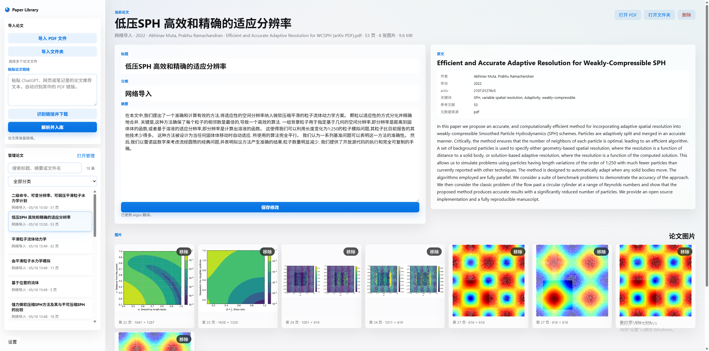
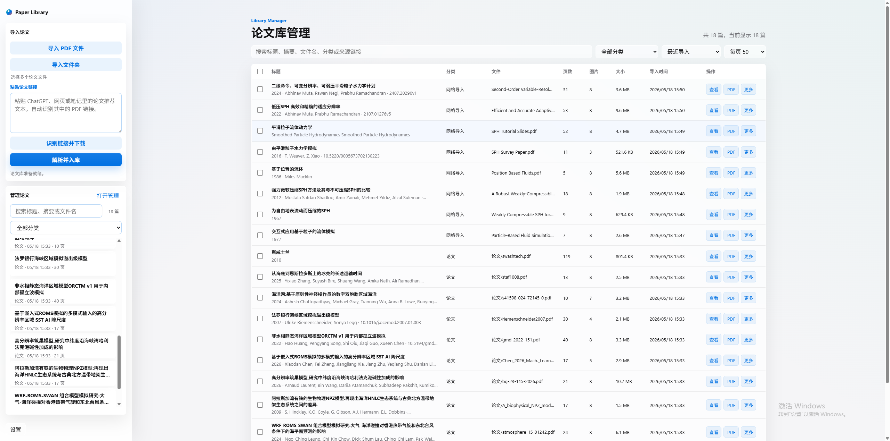
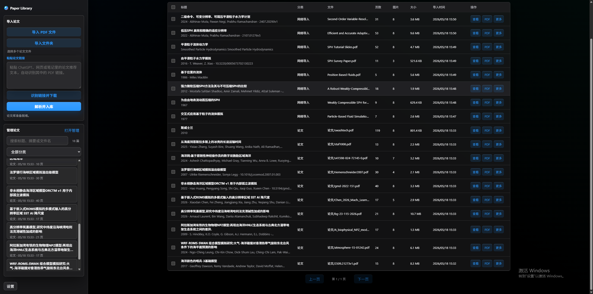
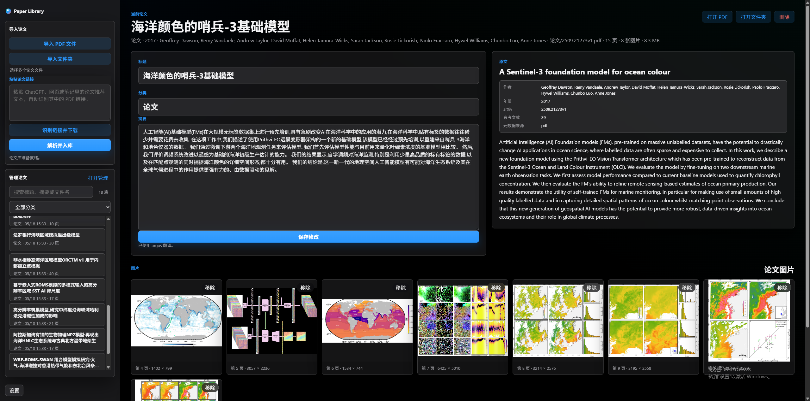

# 作品说明表

## 基本信息

- 花名：论文整理助手
- 类别：研发技术类
- 作品名称：Paper Library

## 使用工具

- AI 工具：ChatGPT / Codex
- 开发语言：Python、HTML、CSS、JavaScript
- 前端技术：原生 HTML / CSS / JavaScript、IndexedDB、本地响应式网页界面
- 后端技术：Python 本地 HTTP 服务、PDF 解析、文件下载、本地文件夹调用
- 主要依赖：PyMuPDF、Argos Translate、PyInstaller
- 运行方式：本地浏览器网页 + 本地解析服务
- 打包方式：PyInstaller 生成 Windows 便携版程序

## 作品用途

Paper Library 是一个本地运行的论文库管理工具，主要用于解决论文 PDF 收集、下载、解析、归类、查找和长期管理分散的问题。

在日常研发、学术调研或技术方案准备过程中，经常会从 ChatGPT、搜索引擎、arXiv、学校网站、期刊网页或同事分享中获得大量论文链接。如果完全手动下载、命名、分类和查找，会花费很多重复时间。Paper Library 的目标是把这些步骤集中到一个本地工具中完成，让用户可以快速把论文资料整理成可搜索、可筛选、可追踪来源的本地论文库。

作品支持三类常见导入方式：

- 导入本地 PDF 文件：适合已经下载好的单篇或多篇论文。
- 导入文件夹：适合一次性整理已有论文资料夹。
- 识别链接并下载：适合把 ChatGPT、网页或笔记中包含的论文推荐文本直接粘贴进来，自动识别其中的 PDF / arXiv 链接并下载入库。

导入后，系统会自动解析论文信息，包括标题、摘要、作者、年份、DOI、arXiv ID、关键词、参考文献数量、页数、文件大小和论文图片，并保存 PDF 副本，方便后续打开和定位。

与岗位业务的关联：

该项目适用于研发、算法、仿真、工程技术、数据分析、学术研究和技术管理等场景。它可以帮助用户快速建立某一方向的论文资料库，例如流体仿真、SPH、机器学习、工程建模、医学图像、材料计算等专题。通过自动解析和本地管理，可以减少重复下载、手动命名、人工整理和反复查找资料的时间成本，提高技术调研和知识沉淀效率。

## 界面具备的功能

### 1. 左侧导入论文模块

左侧栏提供统一的论文导入入口，主要包括：

- “导入 PDF 文件”按钮：选择一个或多个本地 PDF 文件。
- “导入文件夹”按钮：选择一个包含论文 PDF 的文件夹，批量导入其中的论文。
- 文件选择状态提示：显示当前是否已经选择论文文件。
- “粘贴论文链接”文本框：可粘贴 ChatGPT、网页、笔记或 Markdown 文本中的论文推荐内容。
- “识别链接并下载”按钮：从文本框中自动识别 PDF 链接和 arXiv 链接，并准备下载。
- “解析并入库”按钮：统一执行文件解析、链接下载、论文信息提取和保存入库。
- 状态提示：显示当前导入、解析、下载、完成或错误信息。

这部分界面把“选择 PDF 文件、选择文件夹、识别链接下载”放在同一层级，最后再统一点击“解析并入库”，逻辑更接近真实使用流程。

### 2. 左侧管理论文模块

导入模块下方是快速管理区，方便用户不用进入完整管理页也能快速查看最近论文：

- 论文搜索框：按标题、摘要或文件名快速查找。
- 分类筛选下拉框：按论文分类查看。
- 最近论文列表：显示论文标题、分类、导入时间和页数。
- 打开管理入口：进入主区域的大型论文库管理页面。

左侧列表偏向快速浏览和快速定位，不再放置批量选择、批量删除等容易误操作的功能。复杂管理操作集中放在主管理页面中完成。

### 3. 主区域论文详情展示

选择一篇论文后，主区域会展示论文的详细信息：

- 论文标题。
- 中文标题或翻译结果。
- 摘要和中文摘要。
- 作者、年份、DOI、arXiv ID、关键词等元数据。
- PDF 文件名、页数、文件大小、导入时间。
- 来源链接。
- 原始 PDF 打开入口。
- 打开论文副本所在文件夹。
- 论文图片预览区域。

论文图片区域会展示从 PDF 中提取出的图片，方便用户快速判断论文内容，例如实验图、流程图、模型图、结果图等。

### 4. 论文库管理页面

主区域支持打开完整的论文库管理页面，适合管理几百篇或几千篇论文。管理页面以表格形式展示论文库，具备以下功能：

- 搜索：支持搜索标题、摘要、文件名、分类和来源链接。
- 分类筛选：按论文分类筛选。
- 排序：支持按最近导入、最早导入、标题 A-Z、标题 Z-A、文件大小等方式排序。
- 分页：支持每页显示不同数量的论文，避免大量论文一次性铺满页面。
- 表格字段：展示标题、分类、文件、页数、图片数量、大小、导入时间和操作。
- 批量选择：可选择当前页或多篇论文。
- 批量设置分类：一次性为多篇论文修改分类。
- 批量删除：集中删除不需要的论文记录。
- 单篇操作：支持查看、打开 PDF、打开文件夹、打开来源链接和删除。

管理页面把论文类型修改、批量分类、批量删除等高风险或高频管理操作集中起来，避免在左侧快速列表中误操作。

### 5. 设置功能

左下角设置按钮中集中放置全局设置和危险操作：

- 深色模式 / 浅色模式切换。
- 中文 / English 界面切换。
- 清空论文库。

将“清空”放入设置菜单，可以降低误点击风险。深色模式参考苹果官网的视觉风格，使用更柔和的暗色背景、半透明层次和磨砂玻璃质感，让界面在夜间使用时更舒适。

### 6. 视觉与交互设计

界面整体采用偏桌面工具的结构：

- 左侧为导入和快速管理。
- 右侧为论文详情或论文库管理。
- 管理表格适合扫描、筛选和批量处理。
- 按钮保持统一尺寸和统一样式，减少视觉杂乱。
- 关键操作使用蓝色按钮，危险操作使用红色提示。
- 界面加入磨砂玻璃材质、浅色阴影和半透明背景，让工具型界面更精致。
- 深色模式下优化下拉菜单、输入框、表格和按钮显示，避免白底突兀。

## 展示素材

以下四张截图可作为项目展示素材，用于说明 Paper Library 的主要界面、管理能力和深色模式效果。

### 1. 浅色模式论文详情页



该截图展示了浅色模式下的论文详情页。左侧是“导入论文”和“管理论文”模块，右侧展示当前论文的标题、分类、中文摘要、英文原文信息、作者、年份、arXiv、关键词、参考文献数量、PDF 元数据和论文图片。页面顶部提供“打开 PDF”“打开文件夹”“删除”等操作，适合快速阅读和管理单篇论文。

### 2. 浅色模式论文库管理页



该截图展示了论文库管理页面。主区域使用表格展示已导入论文，包含标题、分类、文件、页数、图片数量、文件大小、导入时间和操作按钮。顶部提供搜索框、分类筛选、排序方式和每页数量选择，适合在大量论文中快速检索、筛选和批量整理。

### 3. 深色模式论文库管理页



该截图展示了深色模式下的论文库管理效果。页面在暗色背景下保留清晰的表格边界、按钮层级和左侧模块结构，适合夜间或长时间使用。深色模式中的输入框、下拉框、表格行和操作按钮都经过适配，避免浅色元素突兀。

### 4. 深色模式论文详情页



该截图展示了深色模式下的论文详情页。主区域同时呈现中文整理信息和英文原文信息，下方展示从 PDF 中提取的论文图片。该页面可以体现项目对论文内容解析、元数据展示、图片预览和深色主题视觉效果的综合支持。

## 使用说明

源码运行方式：

```powershell
setup.bat
start.bat
```

默认访问地址：

```text
http://localhost:8000
```

Windows 开箱即用方式：

```text
解压 dist\PaperLibrary-Windows-Portable.zip
双击 PaperLibrary.exe
```

使用流程：

1. 打开 Paper Library。
2. 在左侧选择“导入 PDF 文件”“导入文件夹”，或把论文推荐文本粘贴到链接文本框。
3. 如果粘贴的是文本，先点击“识别链接并下载”。
4. 点击“解析并入库”。
5. 等待系统解析论文标题、摘要、图片和元数据。
6. 在左侧列表或主区域管理页面中查看、搜索、分类和打开论文。

适用人群：

- 需要长期管理论文 PDF 的研发人员、研究生、工程师和技术管理人员。
- 需要根据 ChatGPT 或网页推荐快速批量导入论文的人。
- 需要围绕某个技术方向建立本地论文资料库的人。
- 需要本地保存论文资料，不希望依赖在线论文管理平台的人。
- 需要在 Windows 电脑上开箱即用运行工具的人。

## 创作过程

创作过程中使用 AI 辅助完成了需求梳理、界面结构设计、交互逻辑调整、前后端功能实现、论文解析能力完善、Windows 打包验证和文档整理。

项目最初从一个本地 PDF 解析页面开始，核心目标是让用户选择 PDF 后自动提取标题、摘要和论文图片。随后根据实际使用需求，逐步加入了论文入库、重复文件识别、PDF 副本保存、本地翻译、论文列表展示和详情查看。

在后续迭代中，项目进一步扩展为完整论文库工具：增加了从 ChatGPT 推荐文本中识别论文链接的能力，支持自动下载 PDF 和 arXiv 论文；增加了独立但融合在主界面的论文库管理页，支持搜索、筛选、分页、排序、批量分类和批量删除；增加了打开 PDF、打开论文副本所在文件夹、打开来源链接等贴近日常使用的操作。

界面方面，根据使用反馈不断调整左侧栏逻辑。例如，将“导入 PDF 文件”“导入文件夹”“识别链接并下载”统一放在导入论文模块中，把“管理论文”独立成另一个模块；将“清空论文库”从顶部移入设置菜单，减少误操作；取消左侧列表中的论文选择按钮，把分类修改和批量管理集中放在完整管理页面中。

视觉方面，项目加入了浅色和深色两套主题，并对按钮、输入框、下拉菜单、表格行、操作按钮和左侧卡片做了统一优化。为了让界面更现代，也加入了类似苹果官网风格的磨砂玻璃材质和柔和阴影，使工具在功能密集的情况下仍保持清晰和精致。

打包方面，项目使用 PyInstaller 生成 Windows 便携版，并验证了在不安装 Python 的情况下可以通过 `PaperLibrary.exe` 启动本地服务和网页。打包目录中包含运行依赖、网页文件和本地翻译模型，复制到其他 Windows 电脑后即可使用。
